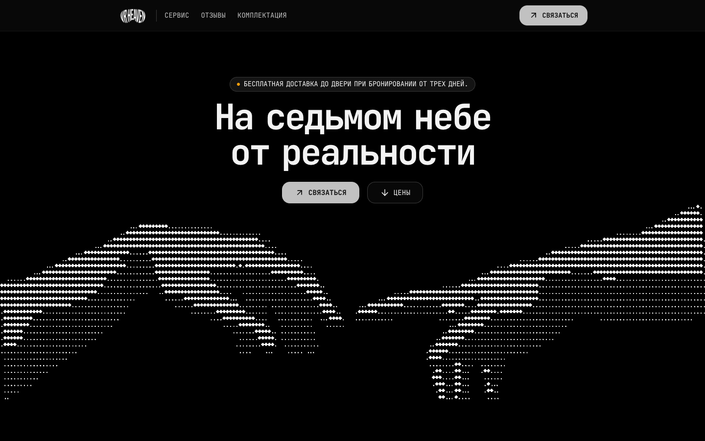
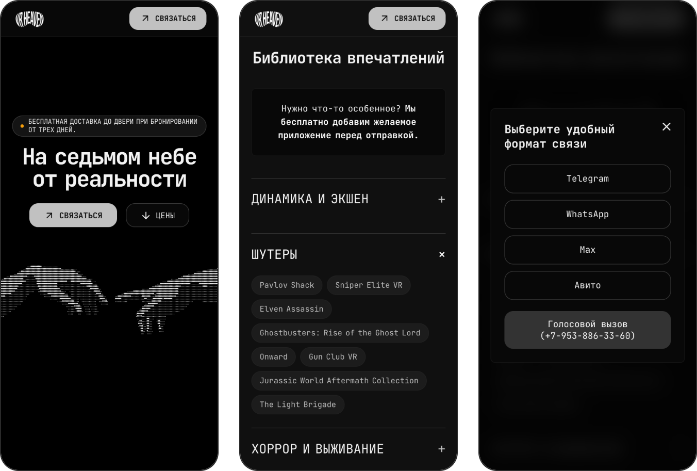

<p align="center">
  Лендинг сервиса аренды VR-шлемов Meta Quest 3S и Quest 3.<br>
  Чистые HTML, CSS и JavaScript: без фреймворков, сборки и зависимостей.
</p>

<p align="center">
  
  
  
  
  
</p>

<p align="center">
  
</p>

## Применение

Сайт работает на [vrheaven.ru](https://vrheaven.ru/) и служит основной страницей сервиса: условия и цены аренды, комплектация, каталог установленных игр, отзывы клиентов и контакты для бронирования.

## Возможности

- Одна страница из трёх файлов: `index.html`, `style.css`, `script.js` - около 1000 строк в сумме.
- Бесконечная карусель отзывов: клонирование слайдов, автопрокрутка с паузой при наведении, свайпы мышью и пальцем, горизонтальная прокрутка трекпадом.
- Каталог игр в виде аккордеона: раскрытие анимируется через `grid-template-rows: 0fr -> 1fr`, без расчёта высоты в JavaScript.
- Появление секций при прокрутке через `IntersectionObserver`.
- Окно связи в два шага: выбор мессенджера или звонка с подтверждением перед переходом по `tel:`; закрытие по `Esc` и клику на фон.
- Open Graph, canonical и набор favicon для корректного превью ссылки.

## Мобильная версия

Отдельная раскладка для экранов уже 544px: своё изображение главного экрана через `<picture>`, перестановка блоков, компактная таблица цен, кнопки карусели над слайдами.

<p align="center">
  
</p>

## Структура проекта

```text
index.html               разметка и контент страницы
style.css                дизайн-токены, компоненты, адаптивные правила
script.js                карусель, аккордеон, модальные окна, анимации
hero-hands*.avif         изображение главного экрана (desktop и mobile)
kit.jpg, logo.png        изображения контента
og-image.jpg             превью для Open Graph
favicon.*, apple-touch-icon.png
CNAME                    домен для GitHub Pages
```

## Запуск

Сайт статический, для локального просмотра достаточно любого HTTP-сервера в корне репозитория:

```bash
git clone https://github.com/TihonSotnikov/VrHeaven-WebSite.git
cd VrHeaven-WebSite
python3 -m http.server 4173
```

Страница открывается по адресу http://localhost:4173.

Публикация: GitHub Pages из корня ветки `main`, домен задан в `CNAME`.
