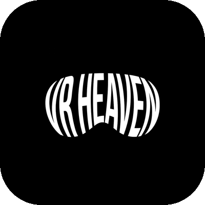
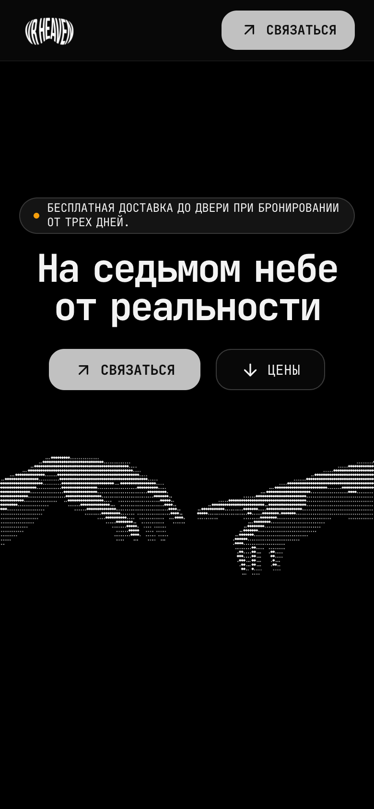
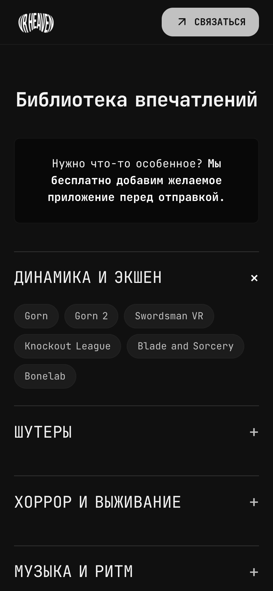
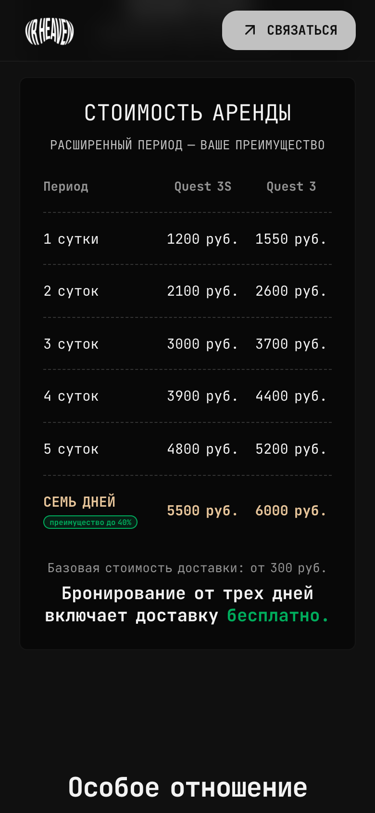
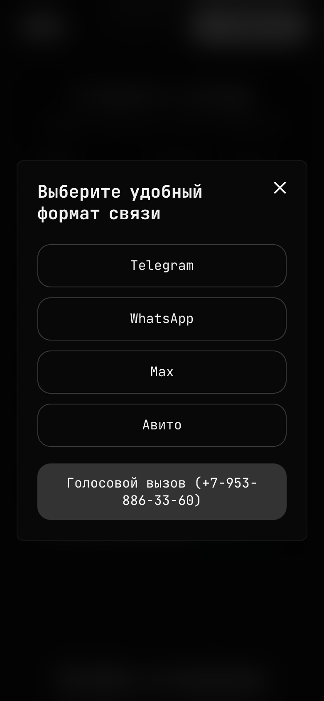
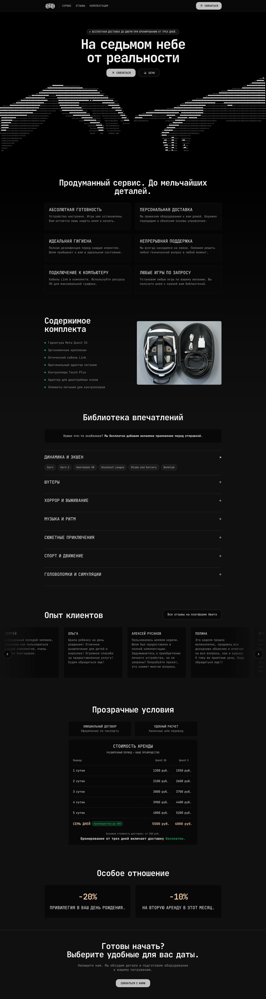

<div align="center">



# VR Heaven

Лендинг сервиса аренды VR-шлемов Meta Quest 3S / 3 с доставкой по Новосибирску.

[**vrheaven.ru**](https://vrheaven.ru)


</div>


## О проекте

Одностраничный сайт для моего сервиса проката VR-шлемов. Проект сделан полностью под ключ: дизайн, вёрстка, интерактив, адаптив под телефоны, публикация на GitHub Pages и подключение своего домена.

Сайт написан на чистых HTML, CSS и JavaScript: без фреймворков, библиотек и сборки. Весь код занимает около 1000 строк в трёх файлах.

## Что реализовано

**Вёрстка и дизайн**
- Тёмная минималистичная тема с моноширинным шрифтом JetBrains Mono.
- Цвета, отступы и скругления вынесены в дизайн-токены (CSS-переменные).
- Адаптивная сетка на CSS Grid и Flexbox, отдельные раскладки для телефона, планшета и десктопа.
- Фиксированная полупрозрачная шапка с размытием фона (`backdrop-filter`).

**Интерактив (vanilla JS)**
- **Карусель отзывов**: бесконечная прокрутка без «скачка» в конце, автопрокрутка стартует, когда блок появляется на экране, и встаёт на паузу при наведении. Листается кнопками, свайпом пальцем или мышью и горизонтальным жестом на трекпаде.
- **Каталог игр**: аккордеон по жанрам, одновременно открыт только один раздел.
- **Окно связи**: выбор мессенджера и отдельное подтверждение перед звонком, чтобы случайное нажатие не набирало номер. Закрывается по `Esc` и по клику на фон.
- **Анимация появления** секций при прокрутке через `IntersectionObserver`.
- **Плавная прокрутка** к якорям с поправкой на высоту фиксированной шапки.

**Оптимизация**
- Главная иллюстрация в формате AVIF весит около 6 КБ, для телефонов через `<picture>` отдаётся отдельная версия.
- Остальные изображения сжаты и подогнаны под реальный размер показа.
- Мета-теги Open Graph: при отправке ссылки в Telegram или WhatsApp показывается карточка с картинкой.
- Favicon и иконка для добавления на домашний экран iOS.

## Мобильная версия

<p align="center">
  
  
  
  
</p>

<details>
<summary><b>Страница целиком (десктоп)</b></summary>
<br>



</details>

## Структура сайта

| Блок | Содержимое |
| --- | --- |
| Главный экран | Слоган, кнопки связи и перехода к ценам, ASCII-иллюстрация |
| Сервис | Шесть карточек с преимуществами |
| Комплектация | Список комплекта и фото |
| Библиотека игр | Аккордеон по жанрам |
| Отзывы | Карусель и ссылка на Авито |
| Цены | Таблица тарифов для двух моделей шлема и условия аренды |
| Бонусы | Скидки |
| Подвал | Призыв связаться |

## Файлы

```
├── index.html               # разметка всех блоков и модальных окон
├── style.css                # дизайн-токены, стили, адаптив
├── script.js                # карусель, аккордеон, модальные окна, анимации
├── *.avif, kit.jpg, logo.png  # изображения
├── favicon.*, apple-touch-icon.png, og-image.jpg
├── CNAME                    # домен для GitHub Pages
└── docs/                    # логотип и скриншоты для README
```

## Запуск локально

Сборка не нужна, достаточно любого статического сервера:

```bash
git clone https://github.com/TihonSotnikov/VrHeaven-WebSite.git
cd VrHeaven-WebSite
python3 -m http.server 4173
```

После этого сайт откроется по адресу http://localhost:4173.

## Деплой

Сайт размещён на GitHub Pages из ветки `main`, домен `vrheaven.ru` задан в файле `CNAME`. Каждый пуш в `main` публикуется автоматически.

---

© VR Heaven. Код открыт для ознакомления. Логотип, фотографии и тексты не предназначены для повторного использования.
